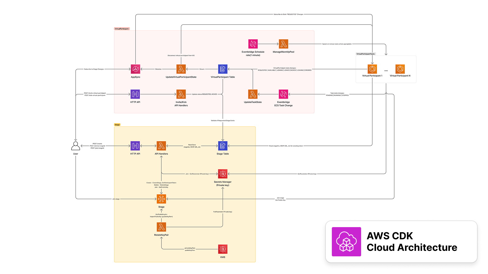
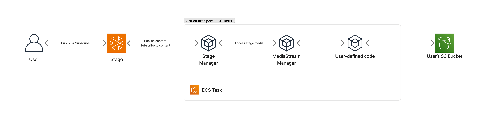

# Amazon IVS Real-time Virtual Participant

This demo provides a sample implementation for a containerized virtual participant that can join an [Amazon IVS Real-time](https://docs.aws.amazon.com/ivs/latest/RealTimeUserGuide/what-is.html) stage, subscribe to content from other participants in the stage, and publish content to the stage as well. The container consists of a Node.js server context and [Puppeteer](https://github.com/puppeteer/puppeteer) client context that communicate via a WebSocket IPC. The client context uses the IVS Web Broadcast SDK to connect to an IVS Real-time stage.



[View full diagram and description](docs/images/vp-arch-overview-description.md).

> [!CAUTION]
> **Use at Your Own Risk**: This is a code sample designed to help developers get started with Amazon IVS. It is not production-ready and will require additional development work to be suitable for production use. It is **not** intended for production use as-is. Its primary goal is to help developers understand the concepts and capabilities of Amazon IVS. By using this solution, you understand and accept its risks and limitations.

## Deploying the application to AWS

### Prerequisites

Before continuing, ensure you have installed the following tools:

- [AWS CLI Version 2](https://docs.aws.amazon.com/cli/latest/userguide/install-cliv2.html)
- [Node.js](https://nodejs.org/en/) v20 and `npm` (npm is usually installed with Node.js)
  - If you have [node version manager](https://github.com/nvm-sh/nvm) installed, run `nvm use` to sync your node version with this project

For configuration specifics, refer to the [AWS CLI User Guide](https://docs.aws.amazon.com/cli/latest/userguide/cli-chap-configure.html).

### Initialize the application and deploy the stack

```bash
make app
```

### Re-deploy the stack

```bash
make deploy
```

### Environment variables

- `ENV`: Application environment for stack deployment. One of `dev` or `prod` (default: `dev`). _(Optional)_
- `STACK`: Stack name (default: `IVSVirtualParticipant-$(ENV)`). _(Optional)_
- `AWS_PROFILE`: Named AWS CLI profile for stack deployment (default: `default`). _(Optional)_

```bash
STACK=<STACK_NAME> ENV=<dev|prod> AWS_PROFILE=default make app
```

## VirtualParticipant Commands

The following commands allow you to interact with IVS stages and the virtual participant.

### Create a stage

```bash
npm run createStage <stack-name>
```

Creates a new IVS Real-Time stage with a participant token.

**Options:**

- `<stack-name>`: Name of the stack deployed to an AWS account **(Required)**

**Example:**

```bash
npm run createStage IVSVirtualParticipant-dev
```

### Delete a stage

```bash
npm run deleteStage -- <stack-name> -s <stage-id> -p <participant-id>
```

Deletes an existing IVS Real-Time stage.

**Options:**

- `<stack-name>`: Name of the stack deployed to an AWS account **(Required)**
- `-s, --stageId`: ID of the stage to delete **(Required)**
- `-p, --participantId`: ID of the participant to remove from the stage **(Required)**

**Example:**

```bash
npm run deleteStage IVSVirtualParticipant-dev -s st-abc123 -p pt-def456
```

### Invite virtual participant

```bash
npm run inviteVp -- <stack-name> -s <stage-id> [-a <asset-name>]
```

Invites a virtual participant to join an existing IVS Real-Time stage.

**Options:**

- `<stack-name>`: Name of the stack deployed to an AWS account **(Required)**
- `-s, --stageId`: ID of the stage to invite the virtual participant to **(Required)**
- `-a, --assetName`: Name of the asset/video content for the virtual participant. _(Optional)_

**Example:**

```bash
npm run inviteVp -- IVSVirtualParticipant-dev -s st-abc123
```

```bash
npm run inviteVp -- IVSVirtualParticipant-dev -s st-abc123 -a video-1.mp4
```

### Kick virtual participant

```bash
npm run kickVp -- <stack-name> -s <stage-id>
```

Removes a virtual participant from an IVS Real-Time stage.

**Options:**

- `<stack-name>`: Name of the stack deployed to an AWS account **(Required)**
- `-s, --stageId`: ID of the stage to remove the virtual participant from **(Required)**

**Example:**

```bash
npm run kickVp -- IVSVirtualParticipant-dev -s st-abc123
```

### Rotate token key-pair

This demo application uses a public/private key-pair to create and verify participant stage tokens.

- The application generates an ECDSA public/private key pair
- The private key is used to sign JSON Web Tokens (JWTs) on the server
- The public key is imported to Amazon IVS for token verification during stage join
- For more details, see the [Amazon IVS documentation on distributing tokens](https://docs.aws.amazon.com/ivs/latest/RealTimeUserGuide/getting-started-distribute-tokens.html)

While the initial key-pair is created automatically when deploying the backend stack, you may need to rotate these keys periodically or immediately if you suspect the private key has been compromised.

To manually rotate the key-pair, run the following command:

```bash
npm run rotateKeyPair -- <stack-name>
```

Note that any running VirtualParticipant tasks must be restarted after rotating the token key-pair.

**Options:**

- `<stack-name>`: Name of the stack deployed to an AWS account **(Required)**

**Example:**

```bash
npm run rotateKeyPair -- IVSVirtualParticipant-dev
```

## Sample implementations

### Stream pre-recorded content to a real-time stage



[Diagram description](docs/images/vp-arch-example-vod-stream-description.md).

This sample implementation streams pre-recorded content from an S3 bucket to the real-time stage. For more information on this, refer to the [container documentation](/virtualparticipant/README.md).

## About Amazon IVS

Amazon Interactive Video Service (Amazon IVS) is a managed live streaming and stream chat solution that is quick and easy to set up, and ideal for creating interactive video experiences. [Learn more](https://aws.amazon.com/ivs/).

- [Amazon IVS docs](https://docs.aws.amazon.com/ivs/)
- [User Guide](https://docs.aws.amazon.com/ivs/latest/userguide/)
- [API Reference](https://docs.aws.amazon.com/ivs/latest/APIReference/)
- [Setting Up for Streaming with Amazon Interactive Video Service](https://aws.amazon.com/blogs/media/setting-up-for-streaming-with-amazon-ivs/)
- [Learn more about Amazon IVS on IVS.rocks](https://ivs.rocks/)
- [View more demos like this](https://ivs.rocks/examples)

## Security

See [CONTRIBUTING](CONTRIBUTING.md#security-issue-notifications) for more information.

## License

This library is licensed under the MIT-0 License. See the [LICENSE](LICENSE) file.
