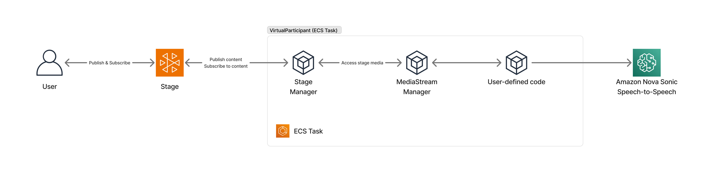

# Amazon IVS Real-time Virtual Participant

This demo provides a sample implementation for a containerized virtual participant that can join an [Amazon IVS Real-time](https://docs.aws.amazon.com/ivs/latest/RealTimeUserGuide/what-is.html) stage, subscribe to content from other participants in the stage, and publish content to the stage as well. The container consists of a Node.js server context and [Puppeteer](https://github.com/puppeteer/puppeteer) client context that communicate via a WebSocket IPC. The client context uses the IVS Web Broadcast SDK to connect to an IVS Real-time stage.


> [!CAUTION]
> **Use at Your Own Risk**: This is a code sample designed to help developers get started with Amazon IVS. It is not production-ready and will require additional development work to be suitable for production use. It is **not** intended for production use as-is. Its primary goal is to help developers understand the concepts and capabilities of Amazon IVS. By using this solution, you understand and accept its risks and limitations.

## Quick links

### Example virtual participants
- [Asset Publisher](#stream-pre-recorded-content-to-a-real-time-stage) - Stream pre-recorded media to a stage
- [Nova S2S](#real-time-conversational-ai-with-amazon-nova-sonic-speech-to-speech) - Conversational AI with Amazon Nova Sonic
- [GPT Realtime](#real-time-conversational-ai-with-gpt-realtime) - Conversational AI with OpenAI GPT Realtime
- [Realtime Captioner](#real-time-captioning-with-speech-recognition) - Live transcription and captions

### Documentation sections
- [Deploy to AWS](#deploying-the-application-to-aws)
- [VirtualParticipant CLI Commands](#virtualparticipant-cli-commands)
- [Virtual Participant Configuration](#virtual-participant-configuration)
- [Sample Implementations](#sample-implementations)
- [About Amazon IVS](#about-amazon-ivs)

## Architecture overview


[View full diagram and description](docs/images/vp-arch-overview-description.md).

## Deploying the application to AWS

### Prerequisites

Before continuing, ensure you have installed the following tools:

- [AWS CLI Version 2](https://docs.aws.amazon.com/cli/latest/userguide/install-cliv2.html)
- [Node.js](https://nodejs.org/en/) v20 and `npm` (npm is usually installed with Node.js)
  - If you have [node version manager](https://github.com/nvm-sh/nvm) installed, run `nvm use` to sync your node version with this project
- [Docker Desktop](https://www.docker.com/products/docker-desktop) - Required for building the containerized virtual participant
  - Ensure Docker Desktop is running on your system before deployment

For configuration specifics, refer to the [AWS CLI User Guide](https://docs.aws.amazon.com/cli/latest/userguide/cli-chap-configure.html).

### Deploy the stack

```bash
npm run deploy
```

Launches an interactive wizard that guides you through the deployment process. You can optionally save deployment configurations locally to simplify re-deploys.

#### List saved configurations

```bash
npm run deploy:list
```

Displays all saved deployment configurations with their details, including virtual participant type, environment, stack name, AWS profile, last deployment timestamp, and deployment count.

#### Delete saved configuration

```bash
npm run deploy:delete
```

Removes a saved deployment configuration from local storage. This command will list all saved configurations and allow you to select a deployment to delete.

**Example:**

```bash
npm run deploy:delete

# Select a configuration to delete and confirm
```

### Stack Environment variables

If you prefer not to use the interactive CLI tool to deploy the application stack, you may use the `make app` command to initialize and deploy a stack, or the `make deploy` command to re-deploy an existing stack. When using the `make <app|deploy>` command, use the following environment variables to specify the deploy configuration.

- `VP`: Virtual participant type to deploy. One of `asset-publisher`, `nova-s2s`, `gpt-realtime`, `realtime-captioner` (default: `asset-publisher`). _(Optional)_
  - `asset-publisher`: Example asset-based virtual participant that publishes pre-recorded media
  - `nova-s2s`: Example real-time conversational virtual participant with Amazon Nova Sonic
  - `gpt-realtime`: Example real-time conversational virtual participant with gpt-realtime
  - `realtime-captioner`: Example real-time captioning virtual participant using the Web Speech Recognition API
- `ENV`: Application environment for stack deployment. One of `dev` or `prod` (default: `dev`). _(Optional)_
- `STACK`: Stack name (default: `IVSVirtualParticipant-$(ENV)`). _(Optional)_
- `AWS_PROFILE`: Named AWS CLI profile for stack deployment (default: `default`). _(Optional)_
- `PUBLIC_API`: Enable public HTTP API via API Gateway (default: `false`). _(Optional)_

```bash
VP=<asset-publisher|nova-s2s|gpt-realtime> STACK=<STACK_NAME> ENV=<dev|prod> PUBLIC_API=<true|false> AWS_PROFILE=default make app
```

### Public API Configuration

By default, Lambda functions are exposed via IAM-authenticated Lambda Function URLs (private access). You can optionally enable a public HTTP API through API Gateway for simpler prototyping with external applications. 

**Important note:** This will make several functions available publicly, meaning that anyone on the public internet will be able to invoke the functions listed in the [Access Methods](#access-methods) section through an HTTP call.

#### Access Methods

**When Public API is Disabled (Default):**
- Functions use individual Lambda Function URLs with AWS IAM authentication
- Each function has its own URL output in the CloudFormation stack
- AWS credentials are required for access

**When Public API is Enabled:**
- The following functions are publicly accessible via API Gateway endpoints:
  - `POST <PublicApiUrl>/stage/create` - Create a new IVS stage
  - `POST <PublicApiUrl>/stage/delete` - Delete an existing IVS stage
  - `POST <PublicApiUrl>/stage/token` - Generate a participant token
  - `POST <PublicApiUrl>/stage/invite` - Invite a virtual participant
  - `POST <PublicApiUrl>/stage/kick` - Kick a virtual participant
- The API Gateway URL is included in the CloudFormation stack outputs as `PublicApiUrl`

## VirtualParticipant CLI Commands

The following CLI commands allow you to interact with IVS stages and the virtual participant.

### Create a stage

```bash
npm run createStage <stack-name>
```

Creates a new IVS Real-Time stage with a participant token.

**Options:**

- `<stack-name>`: Name of the stack deployed to an AWS account **(Required)**

**Example:**

```bash
npm run createStage IVSVirtualParticipant-dev
```

### Delete a stage

```bash
npm run deleteStage -- <stack-name> -s <stage-id> -p <participant-id>
```

Deletes an existing IVS Real-Time stage.

**Options:**

- `<stack-name>`: Name of the stack deployed to an AWS account **(Required)**
- `-s, --stageId`: ID of the stage to delete **(Required)**
- `-p, --participantId`: ID of the participant to remove from the stage **(Required)**

**Example:**

```bash
npm run deleteStage IVSVirtualParticipant-dev -s st-abc123 -p pt-def456
```

### Invite virtual participant

```bash
npm run inviteVp -- <stack-name> -s <stage-id> [-a <asset-name>]
```

Invites a virtual participant to join an existing IVS Real-Time stage.

**Options:**

- `<stack-name>`: Name of the stack deployed to an AWS account **(Required)**
- `-s, --stageId`: ID of the stage to invite the virtual participant to **(Required)**
- `-a, --assetName`: Name of the asset/video content for the virtual participant. _(Optional)_

**Example:**

```bash
npm run inviteVp -- IVSVirtualParticipant-dev -s st-abc123
```

```bash
npm run inviteVp -- IVSVirtualParticipant-dev -s st-abc123 -a video-1.mp4
```

### Kick virtual participant

```bash
npm run kickVp -- <stack-name> -s <stage-id>
```

Removes a virtual participant from an IVS Real-Time stage.

**Options:**

- `<stack-name>`: Name of the stack deployed to an AWS account **(Required)**
- `-s, --stageId`: ID of the stage to remove the virtual participant from **(Required)**

**Example:**

```bash
npm run kickVp -- IVSVirtualParticipant-dev -s st-abc123
```

### List virtual participants

```bash
npm run listVps -- <stack-name>
```

Lists all virtual participants in the system, grouped by their current status.

**Options:**

- `<stack-name>`: Name of the stack deployed to an AWS account **(Required)**

**Example:**

```bash
npm run listVps -- IVSVirtualParticipant-dev
```

### List stages

```bash
npm run listStages -- <stack-name>
```

Lists all IVS Real-Time stages in the system.

**Options:**

- `<stack-name>`: Name of the stack deployed to an AWS account **(Required)**

**Example:**

```bash
npm run listStages -- IVSVirtualParticipant-dev
```

### Stop virtual participants

```bash
npm run stopVps -- <stack-name>
```

Stops all running virtual participant tasks. Once stopped, new tasks will automatically be spawned using the latest task definition based on the minimum number of warm tasks (default: 2) defined in the VP pool manager: `lambda/handlers/manageWarmVpPool.ts`.

**Options:**

- `<stack-name>`: Name of the stack deployed to an AWS account **(Required)**

**Example:**

```bash
npm run stopVps -- IVSVirtualParticipant-dev
```

### Rotate token key-pair

This demo application uses a public/private key-pair to create and verify participant stage tokens.

- The application generates an ECDSA public/private key pair
- The private key is used to sign JSON Web Tokens (JWTs) on the server
- The public key is imported to Amazon IVS for token verification during stage join
- For more details, see the [Amazon IVS documentation on distributing tokens](https://docs.aws.amazon.com/ivs/latest/RealTimeUserGuide/getting-started-distribute-tokens.html)

While the initial key-pair is created automatically when deploying the backend stack, you may need to rotate these keys periodically or immediately if you suspect the private key has been compromised.

To manually rotate the key-pair, run the following command:

```bash
npm run rotateKeyPair -- <stack-name>
```

Note that any running VirtualParticipant tasks must be restarted after rotating the token key-pair.

**Options:**

- `<stack-name>`: Name of the stack deployed to an AWS account **(Required)**

**Example:**

```bash
npm run rotateKeyPair -- IVSVirtualParticipant-dev
```

## Virtual Participant Configuration

### Environment Variables for ECS Containers

You can configure virtual participant behavior using the environment variables available in [.env.example](.env.example). These variables are automatically passed to the ECS container at deployment time, with the `ECS_` prefix removed. Copy the example `.env.example` file to `.env` and replace the placeholder values as needed:

```bash
cp .env.example .env
```

#### Nova speech-to-speech Configuration

When deploying the `nova-s2s` virtual participant, you can customize the following settings:

- `ECS_NOVA_MODEL_ID`: Nova Sonic model ID (default: `amazon.nova-sonic-v1:0`)
- `ECS_NOVA_VOICE_ID`: Voice ID for responses (default: `matthew`. View available voices in the [Amazon Nova docs](https://docs.aws.amazon.com/nova/latest/userguide/prompting-speech-voice-language.html).)
- `ECS_NOVA_SYSTEM_PROMPT`: Custom system prompt to define AI behavior (default: "You are a helpful AI assistant in a video conversation. Be conversational, friendly, and engaging.")
- `BEDROCK_REGION`: AWS region for Bedrock services (default: `us-east-1`)

**Example:**

```bash
# Set in your .env file or export before deployment
export ECS_NOVA_VOICE_ID="matthew"
export ECS_NOVA_SYSTEM_PROMPT="You are a helpful AI assistant in a video conversation. Be conversational, friendly, and engaging."

# Then deploy
npm run deploy
```

#### GPT-Realtime Configuration

When deploying the `gpt-realtime` virtual participant, you must provide an OpenAI API Key:

- `ECS_OPENAI_API_KEY`: OpenAI API Key, with access to gpt-realtime

**Example:**

```bash
# Set in your .env file or export before deployment
export ECS_OPENAI_API_KEY="sk_..."

# Then deploy
npm run deploy
```

**Important Notes for Nova S2S:**
- Your deployment AWS account must have Amazon Bedrock access
- Nova Sonic must be enabled through Bedrock model access in your deployment region
- You must define a BEDROCK_REGION where Amazon Nova Sonic is available (default: `us-east-1`)
- Be sure to monitor your Bedrock usage, as Nova Sonic is billed per audio minute

## Sample implementations

Several sample implementations are provided as docker containers in the [virtualparticipants/](virtualparticipants/README.md) directory.

### Stream pre-recorded content to a real-time stage


[Diagram description](docs/images/vp-arch-example-vod-stream-description.md).

This sample implementation streams pre-recorded content from an S3 bucket to the real-time stage. Follow the [deploy instructions](#deploying-the-application-to-aws) and select `asset-publisher` to deploy this sample.

### Real-time conversational AI with Amazon Nova Sonic Speech-to-Speech



[Diagram description](docs/images/vp-arch-example-nova-s2s-description.md).

This sample implementation demonstrates a real-time conversational AI persona using Amazon Nova Sonic via Amazon Bedrock. The AI persona can engage in natural voice conversations with stage participants, with customizable voice options and system prompts. Follow the [deploy instructions](#deploying-the-application-to-aws) and select `nova-s2s` to deploy this sample.

### Real-time conversational AI with GPT Realtime


[Diagram description](docs/images/vp-arch-example-gpt-realtime-description.md).

This sample implementation demonstrates a real-time conversational AI persona using the GPT realtime API. The AI persona can engage in natural voice conversations with other stage participants, with customizable voice options and system prompts. Follow the [deploy instructions](#deploying-the-application-to-aws) and select `gpt-realtime` to deploy this sample.

### Real-time captioning with Speech Recognition


[Diagram description](docs/images/vp-arch-example-realtime-captioner-description.md).

This sample implementation demonstrates real-time captioning capabilities using speech recognition. The virtual participant can join a stage, subscribe to audio from other participants, and generate real-time captions/transcriptions of the spoken content. Follow the [deploy instructions](#deploying-the-application-to-aws) and select `realtime-captioner` to deploy this sample.

## About Amazon IVS

Amazon Interactive Video Service (Amazon IVS) is a managed live streaming and stream chat solution that is quick and easy to set up, and ideal for creating interactive video experiences. [Learn more](https://aws.amazon.com/ivs/).

- [Amazon IVS docs](https://docs.aws.amazon.com/ivs/)
- [User Guide](https://docs.aws.amazon.com/ivs/latest/userguide/)
- [API Reference](https://docs.aws.amazon.com/ivs/latest/APIReference/)
- [Setting Up for Streaming with Amazon Interactive Video Service](https://aws.amazon.com/blogs/media/setting-up-for-streaming-with-amazon-ivs/)
- [Learn more about Amazon IVS on IVS.rocks](https://ivs.rocks/)
- [View more demos like this](https://ivs.rocks/examples)

## Security

See [CONTRIBUTING](CONTRIBUTING.md#security-issue-notifications) for more information.

## License

This library is licensed under the MIT-0 License. See the [LICENSE](LICENSE) file.
