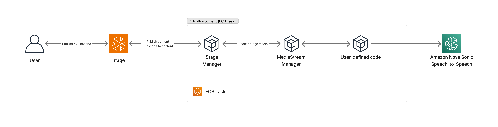

AWS architecture diagram showing an AI-powered media streaming workflow. The flow begins with a User who can publish and subscribe to content through an Amazon IVS Real-time Stage. The process continues through a VirtualParticipant ECS Task that contains several components in sequence: Stage Manager (which accesses stage media), MediaStream Manager, User-defined code, and finally connects to Amazon Nova Sonic Speech-to-Speech service. An ECS Task component is highlighted at the bottom of the diagram. Arrows indicate the directional flow of data between each service component.
